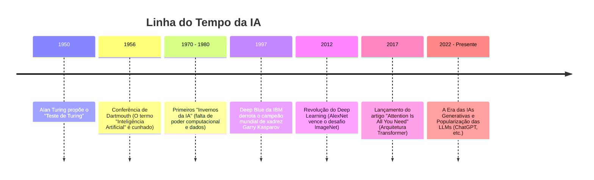

# Guia de Estudos: Introdução à Inteligência Artificial 🚀

Olá! Este repositório foi criado para documentar meus estudos e revisar conceitos fundamentais sobre **Inteligência Artificial (IA)**. Aqui você encontrará um resumo didático sobre a história da IA, o funcionamento de modelos de linguagem (LLMs), conceitos de Deep Learning e a revolução das IAs Generativas.

---

## 📌 Sumário

- [1. Como a Inteligência Artificial Nasceu (História)](#1-como-a-inteligência-artificial-nasceu-história)
- [2. Como uma IA é Treinada e o que são LLMs](#2-como-uma-ia-é-treinada-e-o-que-são-llms)
- [3. Entendendo Deep Learning](#3-entendendo-deep-learning)
- [4. A Era das IAs Generativas](#4-a-era-das-ias-generativas)
- [5. Como Continuar Praticando na DIO](#5-como-continuar-praticando-na-dio)

---

## 1. Como a Inteligência Artificial Nasceu (História)

A ideia de criar máquinas que pensam não é nova, mas a Inteligência Artificial como campo científico oficial nasceu em meados do século XX.



### Principais Marcos Históricos:
*   **O Teste de Turing (1950):** Alan Turing publicou o artigo *"Computing Machinery and Intelligence"*, propondo a pergunta: *"As máquinas podem pensar?"*. Ele criou o famoso Teste de Turing para avaliar se um computador consegue se passar por um ser humano em uma conversa textual.
*   **A Conferência de Dartmouth (1956):** Considerada o marco zero da IA. Cientistas como John McCarthy (que cunhou o termo "Inteligência Artificial"), Marvin Minsky e Herbert Simon se reuniram com a convicção de que qualquer aspecto do aprendizado ou inteligência poderia ser descrito e simulado por uma máquina.
*   **Os Invernos da IA (*AI Winters*):** Períodos (principalmente nas décadas de 70 e 80) em que as expectativas exageradas não foram alcançadas. O financiamento público e privado despencou porque a tecnologia da época não tinha capacidade de processamento nem dados suficientes para resolver problemas reais.
*   **O Retorno Triunfal:** A IA renasceu graças a dois fatores principais: **Big Data** (disponibilidade massiva de dados com a internet) e o avanço das **GPUs** (placas de vídeo ideais para processar cálculos matemáticos em paralelo).

---

## 2. Como uma IA é Treinada e o que são LLMs

Para entender como uma IA aprende, pense em como uma criança aprende a reconhecer objetos. Não damos a ela um manual de regras matemáticas; mostramos vários exemplos (fotos de gatos e cachorros) até que o cérebro dela aprenda a diferenciar.

### O Processo de Treinamento
O treinamento de uma IA moderna é dividido em três fases principais:

1.  **Pré-treinamento (Pre-training):** A IA lê volumes gigantescos de texto da internet (livros, artigos, sites). Nessa fase, ela aprende a estrutura da linguagem, gramática e fatos do mundo, basicamente tentando adivinhar qual é a próxima palavra de uma frase.
2.  **Ajuste Fino (Fine-Tuning):** O modelo geral é especializado para tarefas específicas (como responder a perguntas médicas, programar ou atuar como um assistente amigável).
3.  **RLHF (Aprendizado por Reforço com Feedback Humano):** Humanos avaliam as respostas da IA, pontuando as melhores e corrigindo as ruins. A IA ajusta seus parâmetros internos para se comportar de forma mais útil, segura e ética.

### O que são LLMs?
**LLM** significa *Large Language Model* (Grande Modelo de Linguagem).
*   **Analogia simples:** Pense nas LLMs como o corretor ortográfico do seu celular, mas elevado à décima potência. Ele não tenta "pensar" como nós, mas sim calcular a probabilidade estatística de qual palavra deve vir a seguir.
*   **O segredo das LLMs (Transformers):** Em 2017, o Google apresentou a arquitetura **Transformer** no artigo *"Attention Is All You Need"*. O grande diferencial dos Transformers é o mecanismo de **Atenção (Attention)**, que permite ao modelo olhar para todas as palavras de uma frase ao mesmo tempo e entender o contexto global (por exemplo, diferenciar "banco" de sentar e "banco" de dinheiro).

---

## 3. Entendendo Deep Learning

O **Deep Learning** (Aprendizado Profundo) é um subcampo do Machine Learning (Aprendizado de Máquina) inspirado na estrutura de neurônios do cérebro humano.

```
┌───────────────────────────────────────────────┐
│ Inteligência Artificial (Conceito Geral)      │
│  ┌─────────────────────────────────────────┐  │
│  │ Machine Learning (Aprende com dados)    │  │
│  │  ┌───────────────────────────────────┐  │  │
│  │  │ Deep Learning (Redes Neurais)     │  │  │
│  │  └───────────────────────────────────┘  │  │
│  └─────────────────────────────────────────┘  │
└───────────────────────────────────────────────┘
```

### Redes Neurais Artificiais
Uma rede neural é composta por camadas de "neurônios" matemáticos interconectados:
*   **Camada de Entrada (Input Layer):** Recebe os dados brutos (por exemplo, os pixels de uma imagem).
*   **Camadas Ocultas (Hidden Layers):** Processam as informações em níveis crescentes de abstração. Em Deep Learning, existem muitas dessas camadas (daí o termo "Deep" ou profundo).
    *   *Exemplo:* Na primeira camada oculta, a rede identifica apenas linhas e bordas. Na segunda, curvas e formas. Na terceira, partes do rosto (olhos, focinho).
*   **Camada de Saída (Output Layer):** Entrega o resultado final (por exemplo, "É um gato" com 98% de certeza).

> 💡 **Qual a diferença entre Machine Learning e Deep Learning?**
> No Machine Learning tradicional, um engenheiro precisa extrair manualmente as características mais importantes dos dados (ex: dizer ao algoritmo para olhar o tamanho das orelhas do animal). No Deep Learning, a própria rede neural aprende sozinha a identificar quais características são importantes a partir dos dados brutos.

---

## 4. A Era das IAs Generativas

A **IA Generativa** é uma ramificação da inteligência artificial focada em **criar** novos conteúdos originais (textos, imagens, músicas, códigos de programação, vídeos) em vez de apenas analisar ou classificar dados existentes.

### Como elas funcionam?
Diferente das IAs tradicionais que dizem se uma foto é de um gato ou não, a IA Generativa recebe uma instrução (um *prompt*) e gera uma imagem totalmente nova de um gato com base em tudo o que aprendeu sobre como gatos se parecem.

Existem arquiteturas fundamentais por trás dessa revolução:
*   **Modelos de Difusão (Diffusion Models):** Muito usados para geração de imagem (como Midjourney e DALL-E). Eles começam adicionando ruído digital (estática) a uma imagem até que ela vire puro ruído, e depois treinam a IA para fazer o caminho inverso: remover o ruído passo a passo até reconstruir uma imagem nítida alinhada com o texto que você digitou.
*   **Modelos Baseados em Transformers:** Usados para geração de texto e código (GPT, Claude, Gemini). Eles geram conteúdo sequencial prevendo a próxima unidade de texto (chamada de *token*).

---

## 5. Como Continuar Praticando na DIO

Para fixar esses conceitos na prática, recomendo acompanhar as trilhas e experiências da [DIO](https://dio.me):

*   **Formações e Cursos:** Busque pelas formações de Inteligência Artificial e Engenharia de Prompts na plataforma para criar seus primeiros modelos e interagir com APIs de IA.
*   **Desafios de Código e Projeto:** Coloque a mão na massa desenvolvendo assistentes simples ou utilizando IA para otimizar seus códigos.
*   **Meta de Estudo:** Lembre-se de utilizar a ferramenta **Meta de Estudo** dentro do painel da DIO para organizar seus horários semanais, criar o hábito de estudos e acompanhar sua evolução!

---

> 🧠 **Dica de fixação:** Tente explicar um desses conceitos (como LLMs ou Deep Learning) para um colega ou familiar usando uma analogia simples. Ensinar é a melhor forma de consolidar o próprio aprendizado!
